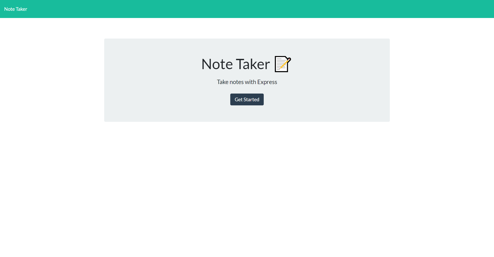
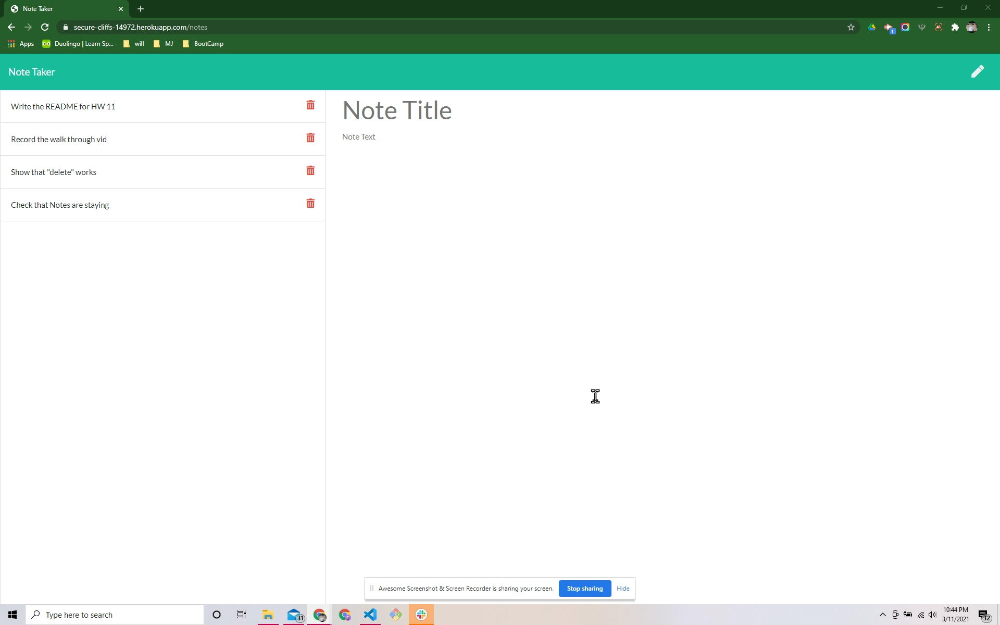

  
# **Note-Taker-2**

## Link to live deployment:
[Note-Taker-2 on Heroku](https://secure-cliffs-14972.herokuapp.com/)

# Table of Contents
* [Project Description](#project-description)
* [Installation](#installation)
* [Usage](#usage)
* [Tests](#tests)
* [License](#license)
* [Contributions](#contributions)
* [Questions](#questions)
# Project Description

This app allows the user to take notes by creating a title and a body for the note.  When the information is gathered, the app adds the new note to a list of notes the user can click on to review the note or click on the trash can icon to delete the note.

### Technologies used:
- javaScript
- Node.js
- Express.js
- Heroku
- GitHub
- GitBash
    
# Installation
 
 1. Clone this repo  
 2. Type **npm i** in the command line.
 3. Open **server.js** in the console.   
 4. 

# Usage

This app allows the user to take notes by creating a title and a body for the note.  When the information is gathered, the app adds the new note to a list of notes the user can click on to review the note or click on the trash can icon to delete the note.

# Tests

I don't have any tests yet.  I am working on it.

# License

MIT

# Contributions

Thank you for your interest in contributing.  You can fork this project and adapt it to fit your needs.

# Questions

If you have any questions, please contact the project owner by clicking on the email listed below.  
     
#### [charvey0](https://github.com/charvey0)
#### [charvey0@gmail.com](mailto:charvey0@gmail.com)
